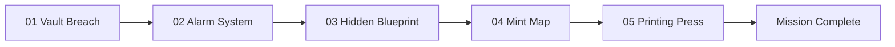

# CODEVERSE 2.0 | Royal Mint Heist

**A five-stage team cyber-heist challenge.** Investigate intercepted evidence, debug security code, reverse-engineer a hidden archive, plot a safe escape, and train a machine-learning model before the final press run.

> This guide explains the game mechanics without publishing solution codes or the server-side answer key.

## At A Glance

| Stage | Challenge | What you do to clear it |
| --- | --- | --- |
| 01 | **Vault Breach** | Correlate the evidence, apply the digit shift, and enter the six-digit PIN. |
| 02 | **Alarm System** | Repair one of three Python data-science routines and pass its disarm check. |
| 03 | **Hidden Blueprint** | Investigate the in-game DevTools clues and submit the recovered extraction code. |
| 04 | **The Leak + Mint Map** | Find a connected route through the mint that satisfies every patrol window. |
| 05 | **Printing Press** | Train a regression model and benchmark exactly 1,500 test predictions. |

Each stage is worth up to 10 points. Completing all five stages gives a 50-point maximum. Time, failed submissions, hints, route quality, and model error can affect awarded points.

## Play The Campaign

### 1. Vault Breach

1. Register a team or log in with the team name and passcode.
2. Read the intercepted dossier. Use the evidence to identify the door, witness, metal lot, and shift described by the briefing.
3. Use the **Caesar Digit Shift Terminal** to apply the shift to the extracted values. The digit wheel wraps modulo 10.
4. Enter the resulting six digits on the keypad and choose **Open**.

The evidence is the puzzle. A failed PIN does not advance the campaign.

### 2. Alarm System

1. Select one of the three alarm subroutines: NumPy telemetry normalization, Pandas rolling VWAP, or scikit-learn classifier calibration.
2. Inspect the starter code and the challenge description, then repair its defects in the editor.
3. Choose **Run Test** to see standard output and errors in the console. **Reset** restores the selected starter code.
4. When the output satisfies the disarm check, choose **Neutralize** to record the result.

The three routines are alternatives; clearing one successfully advances the stage. Test runs are for iteration; the successful **Neutralize** submission is what records completion.

### 3. Hidden Blueprint

Use the built-in inspector as a small web-forensics workstation:

1. In **Elements & DOM**, inspect the archive markup and its hidden clues.
2. In **Styles (CSS)**, use the override control to reveal the archive relay.
3. In **Network (API)**, inspect the ping, manifest, and press records. Follow the artifacts and their references between panels.
4. In **LocalStorage**, inspect the archived key-value data for the fragment needed by the blueprint query.
5. Query the fragment, then submit the recovered extraction code.

The panels simulate the investigation workflow; you do not need to open your browser's real developer tools.

### 4. The Leak + Mint Map

1. Start at Chamber 0. Click a directly connected chamber to extend the route; the graph shows corridor travel times and each chamber's patrol window.
2. Reach Chamber 20 without revisiting a chamber. Routes must follow connected corridors.
3. Read the live telemetry: arrival time must fall inside every visited chamber's displayed window. The score cost is **risk + 2 × time**, so a legal lower-cost route scores better.
4. Use **Reset Path** to start again. Once the route is legal, choose **Confirm & Execute Infiltration**.

The evaluator reports patrol-window failures and the risk, time, and cost for the current route before submission.

### 5. Printing Press

1. Review the dataset information and starter model in the editor. The runtime provides `train_df` and `test_df`; the target column is `amount_printed`.
2. Train using the labeled training rows and assign predictions for the test rows to a variable named `predictions`.
3. Ensure `predictions` contains exactly **1,500 finite numeric values**. NaN and infinite values are rejected.
4. Choose **Test Run** to check execution and inspect any output or plot. Choose **Submit for Benchmark** to score the model against the private server-side answer key.

The benchmark scores prediction accuracy; its answer key is not included in the public game data.

## Team Progress And Scoring

- Use the dashboard to view stage state, score, attempts, hints, elapsed time, and team rank.
- The leaderboard ranks active teams. The final screen shows the campaign score out of 50.
- Hints and failed attempts can reduce points. The exact scoring rules are administrator-configurable.
- Skipping a stage permanently marks it skipped and advances the team. A skipped stage cannot be replayed through normal progression; skip points and penalties depend on the current configuration.
- Team progress is stored in Supabase. Teams sign in with their event account, so progress follows the team to any browser.

## Setup, Admin And Deployment

Setup, configuration, administration and deployment for the merged platform are documented in the
repository [README](../README.md). Teams sign in once on the landing page; this phase is served at
`/phase1/` and its API under `/api/phase1`.
