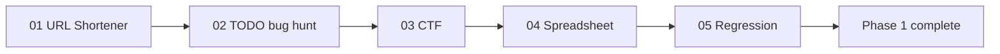

# CODEVERSE 2.0 | Phase 1 — Challenge Arena

**Five engineering challenges, one per muscle:** optimization, debugging, reverse engineering, parsing/graphs and ML diagnosis.
Each challenge gives you a **handout** (download it from the stage page), you work on your own machine, and you **submit** your
result on the platform, where it is graded automatically.

> This guide explains the mechanics. Answer keys and hidden tests stay on the server.

## At a glance

| Stage | Challenge | You get | You submit |
| --- | --- | --- | --- |
| 01 | **URL Shortener** — make the slow one fast | a working but deliberately slow service, behaviour tests, a load test | your optimised `shortener.py` (+ a note on the bottlenecks) |
| 02 | **TODO API bug hunt** | a FastAPI + SQLAlchemy app with 3 planted bugs and a pytest suite | the files you changed under `app/` + a root-cause note per bug |
| 03 | **CTF** — pull the password out of the binary | `stage1` and a bonus obfuscated `stage1_xor` (Linux x86-64) | the password, the flag, a method note (+ bonus answers) |
| 04 | **Spreadsheet engine** | a finished pygame grid and an `engine.py` stub | your `engine.py` (formulas, references, cycles) |
| 05 | **Linear regression** — the model that lies | `housing.csv`, `housing_test.csv`, `starter.py` | `solution.py` with `fit_predict` and a `report` |

Every stage is worth up to **10 points** (50 total). Stages unlock in order.

## How scoring works

* **Partial credit.** Submit as often as you like (there is a few-seconds cooldown). The platform keeps your **best** grade.
* **Perfect = automatic completion.** When nothing more can be earned the stage completes and the next one unlocks.
* **Not perfect?** Press **Lock in score & continue** to bank your best grade and move on (you cannot return), or keep improving.
* **Deductions.** Each hint costs points (−0.5 / −1.0 / −1.5). Stage 03 also charges −0.25 per wrong answer — don't guess.
* **Skip** (from the Dashboard) gives 0 points for the stage and unlocks the next.
* Your running score is on the leaderboard while a stage is open, so every point you bank counts immediately.

## Stage details

### 01 — URL Shortener (Systems / optimization)
`POST /shorten` returns a short code, `GET /{code}` redirects (301). It works, but it re-reads a JSON file on every request,
scans every stored URL for duplicates and for code collisions. Profile it, fix the bottlenecks and keep behaviour identical.
Graded: correctness gate (2) · speedup vs. the baseline, full marks at 20× (6) · an LRU cache on the read path (1) · a note naming the bottlenecks (1).

### 02 — TODO API bug hunt (Debugging)
Run `pytest`; four tests are red. Find the three bugs (easy → medium → hard), fix them minimally, never edit the tests, and
write a one-line **root cause** for each — *why* it was wrong. Graded: 1 point per bug fixed + 1 per correct root-cause note (6, scaled to 10);
tests that were green and break again cost points. The hard bug returns success and still loses data — read the next request, not the response.

### 03 — CTF (Security / reverse engineering)
The password is inside `stage1`. Recover it statically (`strings`, Ghidra, `objdump`) or dynamically (`ltrace`, `gdb`) — no brute force.
Submit the password, the flag and how you did it. Bonus: `stage1_xor` hides everything behind XOR; `strings` won't help.
Only run binaries on a machine you own (WSL / VM / Docker).

### 04 — Spreadsheet engine (Parsing / graphs)
Write the engine behind the grid: `=` formulas with `+ - * /`, parentheses, numbers and references (`A0`, `B3`); chained references;
recompute **only what is downstream** of a change, in topological order; show `#CYCLE` for reference cycles. The docstring of `engine.py` is the full spec.
Graded headlessly by tier: baseline (eval + precedence) · core (chains + propagation) · hard (minimal recompute + cycles).

### 05 — Linear regression (ML / diagnosis)
A naive `LinearRegression` looks great on training data and falls apart on test. Find out why *before* you fix it: residual plots, VIF, train/test gap.
Fix every trap, keep the coefficients explainable in a sentence, and report one line per trap naming the diagnostic that caught it.
Graded on a hidden holdout over 5 resampled seeds — stability matters.

